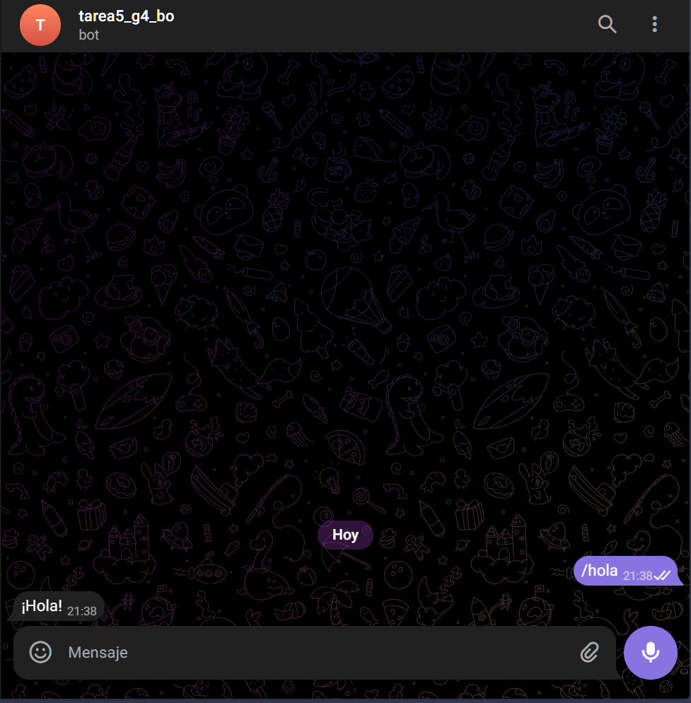
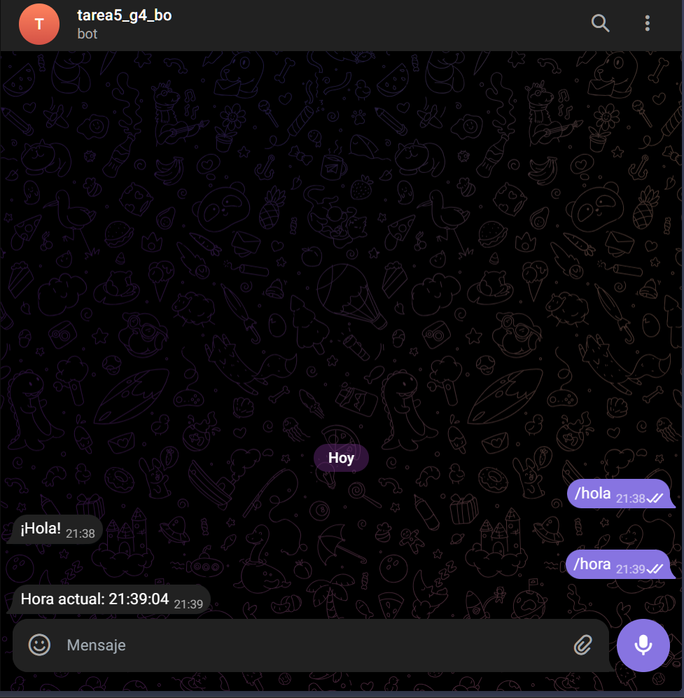
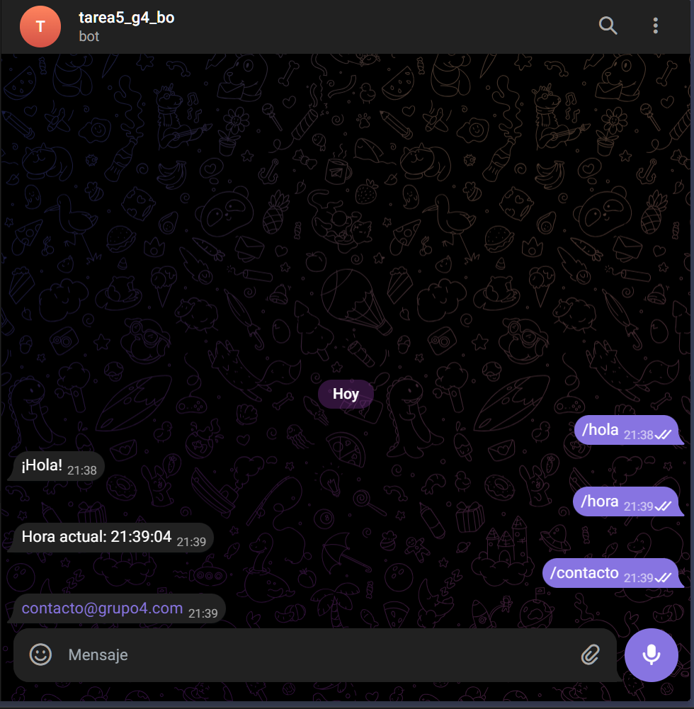
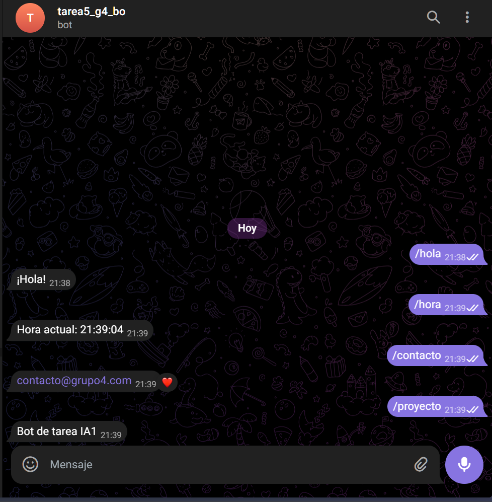

# Bot de Telegram - Mini Asistente

Bot conversacional para Telegram desarrollado en Python para Inteligencia Artificial 1.

## Integrantes

- Yania Eszter Dávid Cadenas - Carnet: 202010175 (25%)
- Naomi Rashel Yos Cujcuj - Carnet: 202001814 (25%)
- Daniel Eduardo Velásquez Avila - Carnet: 202200041 (25%)
- Dominic Juan Pablo Ruano Perez - Carnet: 202200075 (25%)

## Requisitos previos

- Python 3.7 o superior
- Acceso a internet
- Token de bot de Telegram (obtenido de BotFather)

## Instalación

### 1. Clonar o descargar el proyecto

# Bot de Telegram - Mini Asistente

Proyecto académico para la asignatura de Inteligencia Artificial 1. Este repositorio contiene un bot de Telegram simple desarrollado en Python, pensado como un mini asistente para la tarea del curso.

## Descripción del bot

Bot simple que responde a comandos básicos desde Telegram. Está diseñado para ejecutarse localmente usando polling y carga el token desde un archivo `.env`.


3. Instala dependencias:

```bash
pip install -r requirements.txt
```

4. Configura variables de entorno:

- Copia `.env.example` a `.env` y reemplaza `YOUR_BOT_TOKEN` por el token de BotFather.

```text
BOT_TOKEN=tu_token_aqui
```

5. Ejecuta el bot:

```bash
python bot.py
```

El bot iniciará en modo polling y mostrará: "Bot iniciado. Presiona Ctrl+C para detener.".

## Comandos disponibles

- `/hola` — Saludo básico del bot.

- `/hora` — Devuelve la hora actual del sistema en formato HH:MM:SS.

- `/contacto` — Información de contacto

- `/proyecto` — Breve descripción del proyecto.


## ENLACE
[https://t.me/tarea5_g4_bot](https://t.me/tarea5_g4_bot)